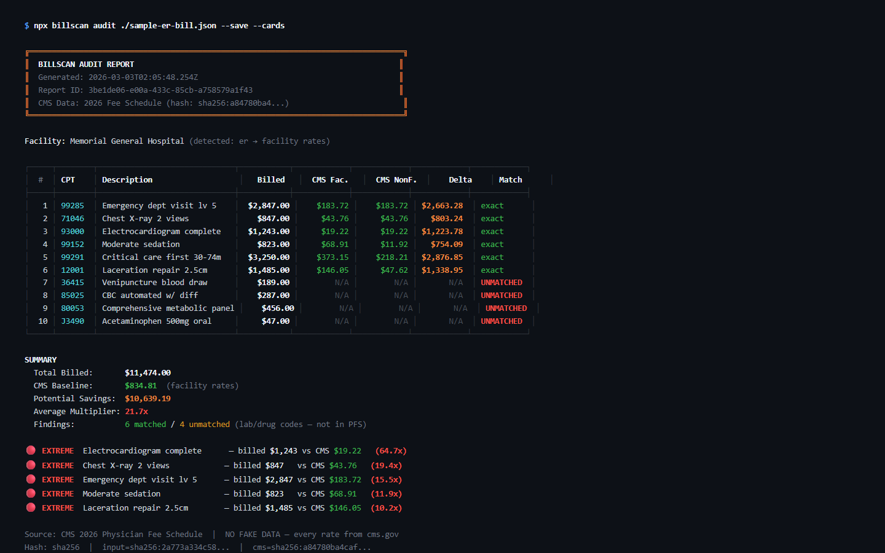

# BillScan 🏥

**AI Medical Bill Auditor** — Compare your medical bills against real CMS Medicare fee schedules to find overcharges.

**No fake data. No demo mode. Every rate pulled from cms.gov.**



## How It Works

1. BillScan downloads the official CMS Physician Fee Schedule (1,035,391 rate rows, 7,012 unique procedure codes)
2. You provide your medical bill (JSON, PDF, or image)
3. BillScan compares every charge against the CMS baseline
4. You get a transparent audit report showing: what you were billed, what Medicare pays, the markup multiplier, and a dispute letter

Every finding shows:
- **Both rates**: facility AND non-facility CMS rates, always
- **Match method**: exact code+modifier+locality, exact code+modifier, exact code only, or unmatched
- **Transparency stamp**: report ID, input hash, CMS data hash, algorithm used
- **Dispute tools**: auto-generated dispute letter and phone negotiation script

## Quick Start

```bash
# Install
npm install

# Download real CMS fee schedule data (~130MB, 1M+ rows)
npx tsx scripts/import-chunk.ts init
npx tsx scripts/import-chunk.ts chunk 0 200000 1
npx tsx scripts/import-chunk.ts chunk 200000 200000 1
# ... continue in 200K chunks until done
npx tsx scripts/import-chunk.ts finalize 1

# Or use the streaming pipeline (requires sufficient memory)
npx tsx scripts/fetch-cms.ts --year 2026

# Audit a bill
npx tsx src/cli.ts audit ./fixtures/sample-er-bill.json --save --letter --phone --cards
```

## Example Output (real CMS 2026 rates)

```
┌─────┬────────┬──────────────────────────┬──────────┬───────────┬───────────┬──────────┬────────────┐
│  #  │ CPT    │ Description              │  Billed  │ CMS Fac.  │ CMS NonF. │  Delta   │ Match      │
├─────┼────────┼──────────────────────────┼──────────┼───────────┼───────────┼──────────┼────────────┤
│   1 │ 99285  │ Emergency dept visit ... │   $2,847 │   $183.72 │   $183.72 │$2,663.28 │ exact      │
│   2 │ 71046  │ Chest X-ray 2 views      │     $847 │    $43.76 │    $43.76 │  $803.24 │ exact      │
│   3 │ 93000  │ Electrocardiogram com... │   $1,243 │    $19.22 │    $19.22 │$1,223.78 │ exact      │
│   4 │ 99152  │ Moderate sedation sam... │     $823 │    $68.91 │    $11.92 │  $754.09 │ exact      │
│   5 │ 99291  │ Critical care first 3... │   $3,250 │   $373.15 │   $218.21 │$2,876.85 │ exact      │
│   6 │ 12001  │ Simple laceration rep... │   $1,485 │   $146.05 │    $47.62 │$1,338.95 │ exact      │
│   7 │ 36415  │ Venipuncture blood draw  │     $189 │      N/A  │      N/A  │      N/A │ NONE       │
└─────┴────────┴──────────────────────────┴──────────┴───────────┴───────────┴──────────┴────────────┘

SUMMARY
  Total Billed:       $11,474
  CMS Baseline:       $834.81  (facility rates)
  Potential Savings:  $10,639.19
  Average Multiplier: 21.7x

🔴 EXTREME  Electrocardiogram complete — billed $1,243 vs CMS $19.22 (64.7x)
🔴 EXTREME  Chest X-ray 2 views       — billed $847   vs CMS $43.76 (19.4x)
🔴 EXTREME  Emergency dept visit lv 5  — billed $2,847 vs CMS $183.72 (15.5x)
```

## CLI Commands

```bash
# Download CMS data
billscan fetch-cms [--year 2026] [--refresh]

# Audit a bill
billscan audit <file> [--save] [--letter] [--phone] [--json] [--cards] [--setting facility|office] [--locality CODE]

# View aggregate stats
billscan stats
```

## Output Flags

| Flag | Description |
|------|-------------|
| `--save` | Persist audit to SQLite database |
| `--letter` | Generate formal dispute letter |
| `--phone` | Generate phone negotiation script |
| `--cards` | Render viral summary card |
| `--json` | Output raw JSON report |
| `--setting` | Force `facility` or `office` rate context |
| `--locality` | CMS locality code for geographic matching |

## Unmatched Codes

Some CPT/HCPCS codes are not in the CMS Physician Fee Schedule:
- **Clinical lab codes** (80000-89999): Priced under the Clinical Lab Fee Schedule
- **J-codes** (J0000-J9999): Drug codes priced under Medicare Part B drug pricing
- **Revenue codes**: Facility-specific, not in PFS

BillScan marks these as `unmatched` — it never fabricates a rate.

## Data Pipeline

```
CMS.gov → PFREV ZIP → Nested ZIPs → PFALL*.txt (130MB, 1M+ rows)
    ↓
Streaming CSV parser → SQLite (batch insert, 5K/txn)
    ↓
Rate matcher (4-tier: code+mod+loc → code+mod → code → unmatched)
    ↓
Audit report + dispute letter + phone script
```

## Tech Stack
- TypeScript, Node.js 20+
- SQLite (better-sqlite3) with WAL mode
- BLAKE3 hashing (SHA-256 fallback) for tamper-evident audit trails
- Real CMS Medicare Physician Fee Schedule data
- Zod schemas for input validation
- Handlebars templates for dispute output
- Tesseract.js for bill image OCR

## Project Structure

```
src/
├── schema/          # Zod schemas (bill, cms, finding, report, dispute)
├── db/              # SQLite connection + migrations
├── collector/       # CMS data fetcher, parser, importer
├── parser/          # Bill parser (JSON, PDF, image/OCR)
├── matcher/         # Rate matching engine (4-tier)
├── analyzer/        # Audit engine
├── output/          # Report builder, card renderer, stats
├── dispute/         # Letter generator, phone script
├── utils/           # BLAKE3/SHA-256 hashing
└── cli.ts           # Commander CLI entry point
```

## License
MIT
